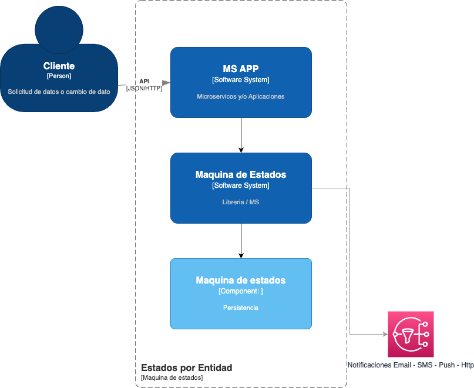
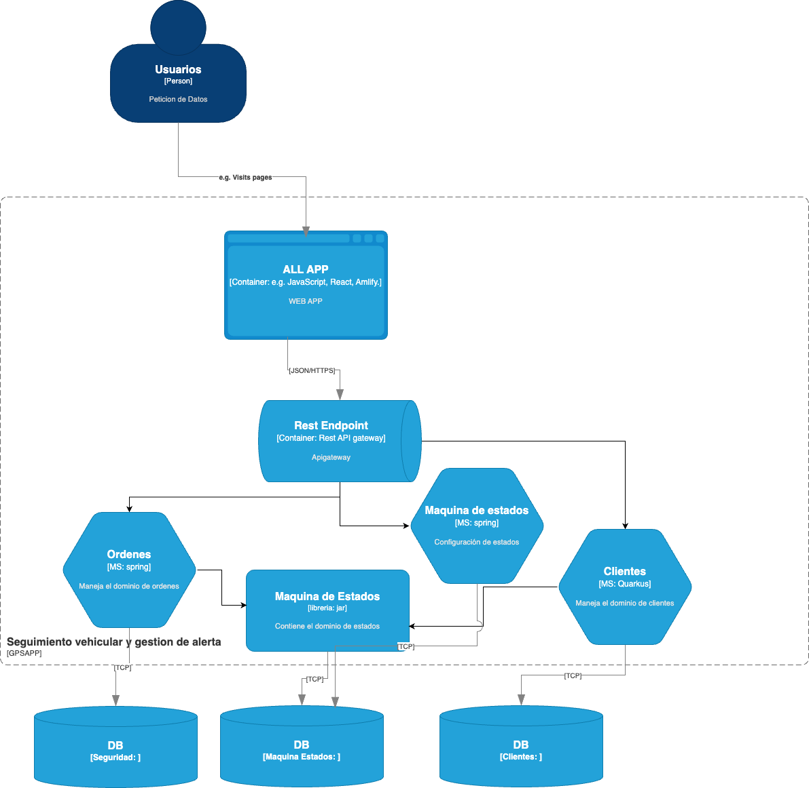
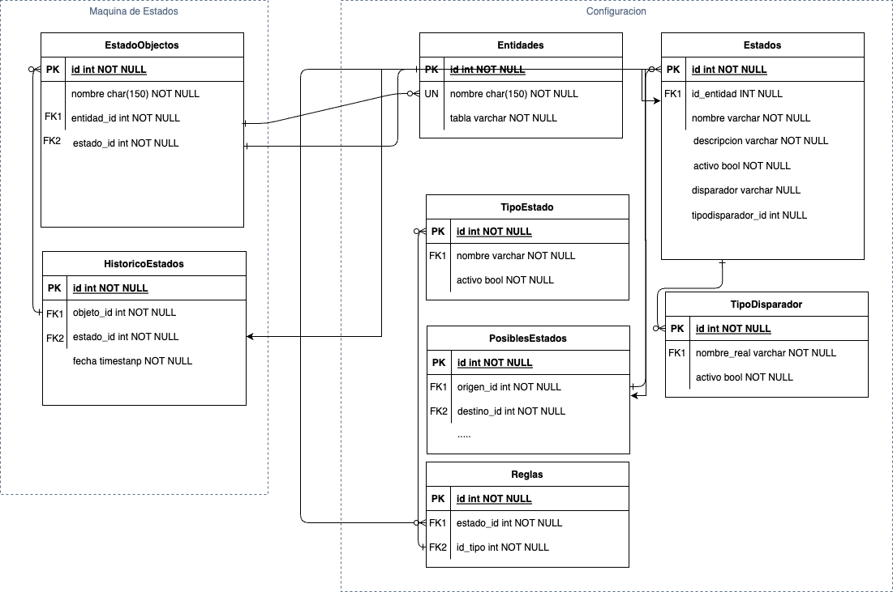
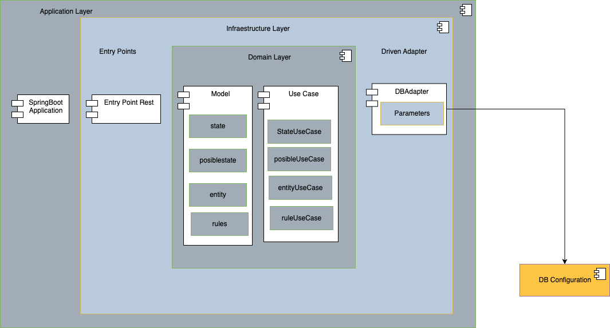

# Prueba Tecnica Maquina de estados

En esta documentacion se resuleve la prueba tecnica para el cargo de Arquitecto TI, de igual manera se propone una alternativa a una libreria y se explican las ventajas.

## Arquitectura de Contexto

El siguiente diagrama nos muestra un contexto general del problema y su solucion, contemplando tres actores principal, las aplicaciones que consumen la maquina de estados, la maquina de estados y su persistencia

## Arquitectura de Contenedor
El siguiente diagrama nos ilustra la propuesta que se compone de una libreria para la implementacion de la maquina de estados y un microservicio de configuracion para hacer dinamica la parametrizacion de estados y sus  acciones

## Arquitectura de Datos

El siguiente diagrama ilustra la persistencia necesaria para manejar la maquina de estados finitos.

- Entidad: Es la lista de clases y/o tipos de objectos posibles.
- Estados: Es la lista de estados definidos por entidad.
- TipoEstados: Esta tabla nos sirve para indicar si el estado es el inicial, por defecto, final o algun otro tipo que no visualizemos actualmente.
- EstadosPosibles: Es la lista de estados posible por estado, es decir de donde a donde puedo pasar.
- TipoDisparador: Esta tabla puede ser util para no solo ejecutar metodos sino tambien, llamar un webservice, lanzar un evento.Etc
- Reglas: Aqui se configura el estado inicial y el estado final.
- EstadosObjectos: Aqui se persiste el estado del objecto.
- HistoricosEstados: Aqui se guardan los estados por los que ha pasado el obejcto.

## Modelo de Clases
El siguiente diagrama de aplicacion ilustra el micro servicio para configurar estados por entidad, sus reglas y sus posibles estados.

| Image | Status | Image | Status |
| ------------- | ------------- | ------------- | ------------- |
| Web Status |   | Shopping Aggregator (Web) |  |
| Basket API |  | Shopping Aggregator (Mobile) |  |
| Catalog API |  | Web Client (MVC) |  |
|Identity API |  | Web Client (SPA) |  |
| Ordering API |  | Webhooks Client |  |
| Payment API |  | Ordering SignalR |  | |

_**Dev** branch contains the latest **beta** code and their images are tagged with `:linux-dev` in our [Docker Hub](https://hub.docker.com/u/eshop)_

## Getting Started

